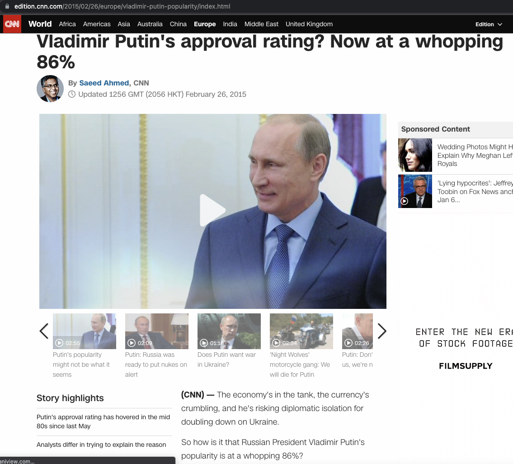

---
output:
  xaringan::moon_reader:
    seal: false
    css: [default, default-fonts, link-style-alt.css]
---

class: center

background-image: url(../images/uh_faculty_of_arts.jpg)
background-size: 95%
background-position: 50% 10%

.left[

]

.box[
# Quantitative Data in Russian Studies
]


.box[
## Sources & Basic Applications
]

.box[
### Eemil Mitikka | Theories & Methods | MARS Programme
]


<br>

.left[
.uhtetx[
**HELSINGIN YLIOPISTO**
<br>
**HELSINGFORS UNIVERSITET**
<br>
**UNIVERSITY OF HELSINKI**
]
]


.left[
Faculty of Arts
<br>
`r format(Sys.Date(), '%d %B, %Y')`
]


<style>
.box {
    background-color: rgba(0,0,0,.5);
    color: #fff;
}
</style>

<style>
.box2 {
    background-color: #F5F5F5;
    color: #000000;
}
</style>

---

```{r echo=FALSE}
library(fontawesome)
```

background-image: url(../images/avatar.jpeg)
background-size: 25%
background-position: 90% 50%

# Contact me/find me at

<br>

`r fa("link")` [https://eemilmitikka.netlify.app/](https://eemilmitikka.netlify.app/)
`r fa("envelope")` [eemil.mitikka@helsinki.fi](mailto:eemil.mitikka@helsinki.fi)
`r fa("youtube")` [Eemil Mitikka](https://www.youtube.com/channel/UC6f_SpVTiB7rZS0Knwb6aYg)
`r fa("linkedin")` [eemil-mitikka](https://www.linkedin.com/in/eemil-mitikka/)
`r fa("twitter")` [@eemilmitikka](https://twitter.com/eemilmitikka)
`r fa("github")` [@eemilmitikka](https://github.com/eemilmitikka)


???

Let me say first a couple of words about myself:
  
  - My name is Eemil Mitikka
  
  - Doctoral Researcher at the University of Helsinki/Aleksanteri Institute
  
  - I study political participation and how it relates to authoritarianism in Russia and post-Soviet countries
  
  - I have background in social sciences and Russian & Eastern European studies
  
  - I also use statistical methods and R in my daily work

Here you can my contact info. Please feel free to contact me through any of these channels. Feel free also to add me as a contact on LinkedIn -- Russia scholars are not a very big group, so it doesn't hurt to have contacts :)

---

# Warm-up &#128173;

<br>

.center[
.large[
## *TASK: Test your numerical knowledge on &#127479;&#127482; by answering the quiz in Zoom*
]

.large[## Rules: NO Googling! &#9757;&#65039;]

<br>

## max 2 minutes! &#9200;
]


???

First, let's have a little warm-up and test your numerical knowledge on Russia. 

There's a little poll in Zoom, please go ahead and answer the questions! :)


---

# Answers

#### [Population](https://en.wikipedia.org/wiki/Russia) of Russia (without Crimea) in 2021 was about 
&#10060; 120 million <br>
&#9989; 144 million <br>
&#10060; 290 million (population of USSR [in 1990s](https://en.wikipedia.org/wiki/Demographics_of_the_Soviet_Union#/media/File:Population_of_former_USSR.PNG))

#### Average [life expectancy]() in Russia in 2021 is about
&#10060; 55 years (in 1949) <br>
&#10060; 64 years (in 1994) <br>
&#9989; 73 years

#### In the last 20 years, infant mortality rate in Russia has
&#9989; More than halved <br>
&#10060; Halved (in ~2013) <br>
&#10060; Doubled

???

Here are the correct answers. You can see how well you did!

Some of the answer alternatives very pulled out of hat, but those within brackets are "correct" numbers but in diffent time, for example.

---

#### In 2020, Russia's [GDP per capita](https://datacommons.org/tools/timeline#&place=country/RUS&statsVar=Amount_EconomicActivity_GrossDomesticProduction_Nominal_PerCapita) was
&#10060; 3 times bigger than in 2000 (in ~2005) <br>
&#9989; 6 times bigger than in 2000 <br>
&#10060; 9 times bigger than in 2000  (in 2013) <br>

#### In 2020, Russia's [military spending](https://en.wikipedia.org/wiki/List_of_countries_by_military_expenditures) was around 62 billion US$. This is
&#9989;  8% of the U.S. military spending <br>
&#10060; 20% of the U.S. military spending <br>
&#10060; 30% of the U.S. military spending

#### Share of population [using the Internet](https://ourworldindata.org/internet) in Russia in 2019 was about

&#10060;  53% of Russians <br>
&#10060; 73% of Russians <br>
&#9989; 83 % of Russians


???

And here are some more answers.

---

#### In 2020, the share of [services](https://data.worldbank.org/indicator/NV.SRV.TOTL.ZS?end=2020&locations=RU&start=1989&view=chart) of Russia's gross domestic product (GDP) was about

&#10060; 37% of GDP (in 1991) <br>
&#10060; 45% of GDP (in 1995) <br>
&#9989; 56% of GDP

#### In 2019, the share [oil rents](https://data.worldbank.org/indicator/NY.GDP.PETR.RT.ZS?locations=RU) of Russia's GDP was about

&#9989; 9% of GDP <br>
&#10060; 15% of GDP (in 2000) <br>
&#10060; 35% of GDP

#### In 2019, there were 25 [suicides](https://data.worldbank.org/indicator/SH.STA.SUIC.P5?locations=RU) per 100,000 people in Russia. This is

&#10060;  Approximately the same figure as in year 2000 <br>
&#10060; About one third less compared to year 2000 (in 2011) <br>
&#9989; More than twice less compared to year 2000


---

background-image: url(https://pi.tedcdn.com/r/pe.tedcdn.com/images/ted/88407_800x600.jpg?cb=20160511&quality=63&u=&w=512)
background-size: 50%
background-position: 95% 50%

# Importance of quantitative data

.large[
.pull-left[
"*The world cannot be understood .blue[without numbers], and it cannot be understood .blue[with numbers alone]. Love numbers for what .blue[they tell you] about real lives*."

-Hans Rosling 

]
]

???

Here's a quote from Hans Rosling, who was a Swedish physician, academic and enthusiastic open data promoter.

I think this quote summarizes quite nicely the meaning and importance of numerical data in modern life.

---


# Outline
.large[
1. Survey data &#128550; &#128577; &#128528; &#128578; &#128522;

2. State statistics 		&#127479;&#127482;	&#128202;

3. International statistics &#127757; &#128200;

4. Apply quantitative data	&#x1F913;
]

<style>
.large {
font-size: 1.5em;
}
</style>

<style>
.blue {
color: blue;
font-style: italic;
}
</style>

???

Here's briefly to outline of today's lecture. 

We'll talk first briefly about the Russian survey data because 

  - this might be interesting to some of you
  
  - there are also some myths and misconceptions related to this kind of data
  
  - not very detailed examination of the topic since I believe Margarita Zavadskaya will talk about survey data later on this course
  
Next, I'll say couple of words briefly about the state statistics

Then, I'll say couple of words about international statistics related to Russia

Finally, I'll give some examples and ideas how to apply quantitative data to your own future work


---

# My goals 	&#127919;
.large[**After this lecture you will**
.pull-left[
* .blue[Know] relevant data sources &#128202;
* Give you some ideas how to .blue[examine] (Russian) quantitative data 	&#129488;
* Be more .blue[confident] in using quantitative (Russian) data 	&#128526;
]
]
--
.pull-right[

]

---

background-image: url(https://cdn.britannica.com/25/69525-050-62EED6EC/George-Gallup.jpg)
background-size: 35%
background-position: 90% 60%

# 1. Survey data &#128550; &#128577; &#128528; &#128578; &#128522;
.pull-left[
.large[
* Historically, surveys/opinion polls were developed in .blue[democratic] context

* George .blue[Gallup] as a pioneer, predicted the re-election of Franklin D. Roosevelt in 1936 against the general expectations
]
]


<style>
.moderate {
font-size: 1.4em;
}
</style>

???

Here's very shortly some historical background for surveys. 

The reason why I mention these things here is that since Russia is non-democratic country with no free press, there are often concerns in both academic and everyday discussions about the reliability and usability of Russian survey data. 

So can we relate to Russian surveys in same way as we relate to surveys conducted in democratic countries?


---

# Survey data &#128550; &#128577; &#128528; &#128578; &#128522;
.large[
* Reliability concerns in authoritarian countries:
  
  1. .blue[Fake numbers]: political legitimacy questions
  
  2. .blue[Opinion manipulation]: state controls the main communication means
  
  3. .blue[Social desirability bias]; survey respondents hide their true opinions when answering
  
]

???

Most typically, the critique of Russian surveys comes in three forms: 

  1. Fake numbers: Russian polling agencies simply present fake numbers to bolster the legitimacy of Putin, the Kremlin and other similar power structures
  
  2. Opinion manipulation: this line of critique suggests that since there is no free media in Russia, the Kremlin can mold the opinion climate through media
  
  3. Social desirability bias: this means that Russians fear the social consequences for expressing their "true opinions", so they simply lie or embellish the truth when answering the surveys

---

# Critique of &#127479;&#127482; surveys

.pull-left[
.moderate["An .blue[opinion poll can only be conducted in a democracy with a free press]. In a country with no free press [...] when a pollster phones people up and asks, 'Hello, do you approve of Vladimir Putin,' the answer is overwhelmingly yes. So what that opinion poll is, is not a poll of approval but it's .blue[a poll of fear]".
]
]

.pull-right[

]

???

I've worked quite a lot with Russian surveys, and I think this quote from Ben Judah depicts quite accurately the most common critique of Russian surveys.

---

# Surveys in &#127479;&#127482;

### Rough division between local & cross-national surveys:

.pull-left[
#### Local surveys
* Levada-Center

* VCIOM

* FOM

* Russian Longitudinal Monitoring Survey

* and others...
]

.pull-right[
#### Cross-national surveys
* World Values Survey

* European Social Survey

* Life in Transition Survey

* International Social Survey Programme

* and others...
]

???

Here are some survey organizations and programmes that operate in Russia. Quite many of you had used the Levada-Center's data in assignments, and this organization is indeed probably the most reputable Russian polling agency. However, when looking for data sources, I'd recommend you to check also the data from state-aligned polling agencies (e.g. VCIOM and FOM): sometimes their surveys contain interesting questions and figures that can tell you something about the Russian society. It's also a good practice to compare the data from different survey organizations on with similar questions to see if they paint a similar picture of the phenomenon -- but we'll get back to this soon.

Many established and high quality survey programmes operate also in Russia, and you may find interesting data from those too. Full datasets are often available only in csv or SPSS/similar statistical programme formats, but quite often you can also subset a smaller dataset of variables in Excel format from their webpages (at least World Values Survey and European Social Survey have these kind of online tools available on their webpages).


---

background-image: url(https://upload.wikimedia.org/wikipedia/en/e/ed/Levada_LOGO.jpg), url(https://upload.wikimedia.org/wikipedia/commons/a/af/Fond_Obshestvennoe_mnenie.png), url(https://upload.wikimedia.org/wikipedia/fi/thumb/8/88/VTsIOM-logo.svg/180px-VTsIOM-logo.svg.png)
background-position: 10% 50%, 90% 50%, 50% 50%
background-size: 25%, 25%, 25%

# Major local survey companies in modern &#127479;&#127482;

---

background-image: url(https://upload.wikimedia.org/wikipedia/en/e/ed/Levada_LOGO.jpg)
background-position: 95% 5%
background-size: 15%

# Local surveys: Levada-Center
.moderate[
* Founded in 2004, named after Yuri Levada

* Current director: Denis Volkov

* Arguably the most trusted polling company among foreign Russia scholars and experts


* Labeled as "foreign agent" in 2016 &#10145;&#65039; the center was [forbidden](https://www.rbc.ru/politics/14/09/2017/59ba9d429a7947911f797399) to conduct exit polls in 2018 presidential elections

* Operates actively and conducts reguraly polls social and political opinions
]

---

background-image: url(https://upload.wikimedia.org/wikipedia/fi/thumb/8/88/VTsIOM-logo.svg/180px-VTsIOM-logo.svg.png)
background-position: 95% 5%
background-size: 15%

# VCIOM

.moderate[
* Established in 1987

* Fullname: Russian Public Opinion Center (Всероссийский центр изучения общественного мнения – ВЦИОМ)

* Become fully state-owned in 2003 &#10145;&#65039; Yuri Levada many former employees left the company and established the Levada-Center in 2004

* Current head of the center: [Valery Fedorov](https://wciom.com/about/staff/fedorov-valery/)

* Conducts regularly surveys on various topics
]

---

# Cross-national surveys in 	&#127479;&#127482;
.moderate[
* Many high-quality and well-documented surveys since the early 1990s

* **Rule of thumb** &#128077;
  - Overall trends 	&#10145;&#65039; use local survey data (e.g. Levada-Center, VCIOM, FOM, etc.)
  - Individual level &#10145;&#65039; use cross-national survey data
  - NB: there are .blue[exceptions]! e.g. [Russian Longitudinal Monitoring Survey](https://rlms-hse.cpc.unc.edu/)
  - Non-Russian research institutions also sometimes offer individual level survey data, e.g. NUPI's [NEORUSS](https://www.hf.uio.no/ilos/english/research/projects/neoruss/) surveys
]

---

background-image: url(https://upload.wikimedia.org/wikipedia/commons/3/31/Logowvs.jpg)
background-size: 25%
background-position: 95% 5%


## World Values Survey

.moderate[
* One of the first global surveys, conducted since early 1980s 

* Covers wide range of countries, Russia has participated since .blue[early 1990s] (excluding Wave 4 in 1999-2004)

* Many data formats, [country-specific](https://www.worldvaluessurvey.org/WVSContents.jsp) files available for Excel (.xlsx), SPSS (.sav) and Stata (.dta)

* Documentation of the first rounds is not ideal &#10145;&#65039; has improved with time
]

---

background-image: url(https://seriss.eu/wp-content/uploads/2015/09/ESS-logo-B.png)
background-size: 25%
background-position: 95% 5%


## European Social Survey

.moderate[
* High-quality comparative survey

* Conducted since 2002

* Russia has participated .blue[since 2006]
  - NB: datasets for .blue[2014] and .blue[2018] are located in [CESSI data archive](http://www.ess-ru.ru/), *not* on ESS's official page &#10145;&#65039; registration needed to download the data
  
* Arguably the most well-documented and high-quality survey (my personal opinion)


]
---

## Some survey data sources on &#127479;&#127482;

.pull-left[
#### General trends data
* Levada-Center, ([Аналитический Центр Юрия Левады](https://www.levada.ru/))

* VCIOM, ([Russian Public Opinion Research Center](https://wciom.com/))

* FOM, ([Фонд «Общественное мнение»](https://fom.ru/))

* Joint Economic and Social Data Archive, ([Единый архив экономических
и социологических данных](http://sophist.hse.ru/)) (NB: registration needed to access complete data)
]

.pull-right[
#### Individual level data
* World Values Survey, ([WVS](https://www.worldvaluessurvey.org/wvs.jsp))

* European Social Survey, ([ESS](https://www.europeansocialsurvey.org/))

* International Social Survey Programme, ([ISSP](http://w.issp.org/menu-top/home/))

* Life in Transition Survey, ([LiTS](https://www.ebrd.com/what-we-do/economic-research-and-data/data/lits.html))

* Russian Longitudinal Monitoring Survey, ([RLMS](https://rlms-hse.cpc.unc.edu/))

* Nation-building and nationalism in today’s Russia, ([NEORUSS](https://www.hf.uio.no/ilos/english/research/projects/neoruss/))

* New Russia Barometer, ([NRB](https://www.cspp.strath.ac.uk//catalog1_0.html)) (NB: might have to contact admin to get the data)

]

---

background-image: url(https://upload.wikimedia.org/wikipedia/en/e/ed/Levada_LOGO.jpg), url(../images/vciom_logo.png)
background-position: 10% 50%, 90% 50%
background-size: 25%, 25%

## Do the numbers differ? &#129300;
### Let's have a look!


---

background-image: url(../images/approval_ratings.png)
background-size: contain

---

# Your turn &#128221;


.pull-left[.assignment[What might cause the .blue[fluctuations] in president's approval ratings in Russia?

Brainstorm &#128173; in groups for 5 minutes &#9200;
] 
]

.pull-right[
.big[&#129488;]
]

<style>
.assignment {
font-size: 1.5em;
}
</style>
---

background-image: url(../images/approval_ratings_interpret.png)
background-size: contain

---

# Some guidelines to interpret survey data

.emphasize[&#10004; Pay attention to the .blue[documentation]  &#128221; how the numbers are .blue[produced]?
 - Who were included: what was the .blue[sampling] method? How this was defined?
 
 - What is the .blue[sample size]? How generalizible are the results?
 
 - How much there is .blue[missing data]? Are there regular patterns in missingness?
 
 - How the questions were .blue[formulated]? Can the question be misunderstood or is there social desirability bias?
]


---

background-image: url(https://www.schelcovo.ru/image/logo/mosoblstat.png)

# 2. State statistics 		&#127479;&#127482;	&#128202;

---

background-image: url(../images/rosstat.png)
background-size: contain

---


background-image: url(https://www.schelcovo.ru/image/logo/mosoblstat.png), url(https://www.bofit.fi/globalassets/bofit/bofit_teksti_fi_rgb.png)
background-size: 15%, 40%
background-position: 98% 5%, 30% 80%


## Rosstat 

.moderate[
* Official state statistics on social and economic issues

* Considered reliable, some critique on lack of openness and accessibility of the data (e.g. [Begtin](https://m.polit.ru/article/2011/10/18/mocsow_begtin/))

* Bank of Finland Institute for Emerging Economies ([BOFIT](https://www.bofit.fi/en/)) collates economic data monthly from Rosstat, Central Bank of Russia, Ministry of Finance, OECD and CEIC &#10145;&#65039; downloadable in CSV format
]

---

background-image: url(https://fontslogo.com/wp-content/uploads/2019/04/World-Bank-Logo-Font.jpg), url(https://www.oecd.org/media/oecdorg/styleassets/images/OECD-social-sharex.jpg), url(https://brandlogos.net/wp-content/uploads/2018/10/international-monetary-fund-logo.png), url(https://logos-download.com/wp-content/uploads/2019/11/Gapminder_Foundationr_Logo_full.png), url(https://tabledebates.org/sites/default/files/styles/contentbox/public/2021-01/Jan212021%20-%20%2833%29.jpg?itok=zudkWkB5), url(https://demoshelsinki.fi/wp-content/uploads/2020/11/undp-logo.png)
background-size: 30%, 30%, 30%, 30%, 30%, 30%
background-position: 5% 30%, 25% 80%, 50% 50%, 80% 80%, 95% 30%, 95% 60%

# 3. International statistics &#127757; &#128200;

---

# International statistics &#127757; &#128200;

.pull-left[
#### .blue[Crude indicators], examples:
* Economical statistics, e.g.
  - Gross Domestic Product
  - Global prices (e.g. oil, gas)
* Population statistics, e.g.
  - Birth/death rates
  - Population growth
* Environmental statistics, e.g.
  - Emissions
  - Pollution
]

.pull-right[
#### .blue[Aggregate indicators], examples:
* Governance indeces
  - The Economist Intelligence Unit ([Democracy Index](https://www.eiu.com/n/campaigns/democracy-index-2020/))
  - Varieties of Democracy ([Liberal Democracy Index](https://www.v-dem.net/en/))
  - Freedom House ([Freedom in the World](https://freedomhouse.org/report/freedom-world))
  - Transparency International ([Corruption Percepetions Index](https://www.transparency.org/en/cpi/2020/index/nzl))
]

.moderate[
.blue[Crude indicators] &#10145;&#65039; measure single variable

.blue[Aggregate indicators] &#10145;&#65039; compile multiple variables into common index
]
---

background-image: url(../images/owid.png)
background-size: contain

???

Our World in Data is perhaps my favorite data source for international statistics, because they compile data from multiple sources and always point out where the original data may be found.


---

# 4. Apply quantitative data	&#x1F913;

.large[
* Today, there is an abundance of statistical tools and packages &#10145;&#65039; can't cover all here

* I'll present some basic principles and ideas for data visualizations

* (Very) brief overview to two statistical softwares:
    1. Excel
    2. R
]


---

## Data visualizations &#127912; &#128202; &#128200;

.large[
* Data visualizations are a powerful way to communicate with your data: .blue[a picture is worth a thousand words]

* Demanded and needed skill in modern research work and beyond

* If possible, .blue[always prefer visualizations over data tables]: visualizations are much more powerful and interesting way of communicating + demonstrate your methodological skills nicely!
  - NB &#9757;&#65039; this principle applies also to more advanced statistical analyses, like regression model results etc.

]

---

## Types of visualizations &#127912; (not all-inclusive list)

####	Scatterplots
  -	Great for visualizing the relationship between two continuous (= non-categorical) variables
  -	Example visualization:
    1.	Life expectancy in years on Y-axis (the vertical axis)
    2.	Gross domestic product (GDP) per capita on X-axis (the horizontal axis)

#### Line plots &#128200;
  - Great for visualizing change over time
  -	Example visualization:
    1.	Life expectancy in years on Y-axis (the vertical axis)
    2.	Year on X-axis (the horizontal axis)
    
---

#### Bar plots &#128202;
  -	Great at comparing statistics for each of several categories
  -	Example visualization:
    1.	Fears (= categories) on the Y-axis (the vertical axis)
    2.	Percentage of fears on the X-axis (the horizontal axis)

####	Histograms
  -	Great at describing the distribution of a one-dimensional numeric variable
  -	Example:
    1.	Life expectancy on the X-axis (the horizontal axis)
    2.	NB! With histograms the Y-axis is always only the number of observations on the X-axis!

#### Box plots &#128230;
  -	Great at comparing the distribution of a numeric variable among several categories
  -	Example:
    1. Life expectancy on the Y-axis (the vertical axis)
    2. Post-Soviet country groups on the X-axis (the horizontal axis)


---

background-image: url(../images/scatterplot_psoviet.png)
background-size: contain

---

background-image: url(../images/lineplot_psoviet.png)
background-size: contain


---


background-image: url(../images/barplot_fears.png)
background-size: contain


---

background-image: url(../images/histogram_psoviet.png)
background-size: contain

---

background-image: url(../images/boxplot_psoviet.png)
background-size: contain

---


## Some basic principles for visualizing data &#128161; &#9757;&#65039;

.large[
- Keep it simple! &#10145;&#65039; for example, avoid 3D visualizations if it doesn’t add any information to the chart
  -	We human beings have difficulties to understand more than 3 dimensions, even if there are more of them

-	Avoid [chartjunk](https://en.wikipedia.org/wiki/Chartjunk#:~:text=Chartjunk%20refers%20to%20all%20visual,the%20viewer%20from%20this%20information.) &#10145;&#65039; in short, remove any unnecessary stuff from your visualizations
]

---

## Some basic principles for visualizing data &#128161; &#9757;&#65039; (cont.)

.large[
-	Keep your numbers simple: 
  -	rule of thumb: decimals aren’t needed when you represent percentages
  
  -	even statistically speaking, max two decimals are (rarely) needed &#10145;&#65039;  adding/cutting decimals don’t affect dramatically to analysis’ results
  
- Use distinguishable &#10145;&#65039; pay also attention to accessibility issues, like color blindness
]


---


background-image: url(https://upload.wikimedia.org/wikipedia/commons/thumb/3/34/Microsoft_Office_Excel_%282019%E2%80%93present%29.svg/800px-Microsoft_Office_Excel_%282019%E2%80%93present%29.svg.png)
background-size: 15%
background-position: 95% 5%

## Softwares: Excel
.moderate[
* Widely used "What You See Is What You Get" ([WYSIWYG](https://en.wikipedia.org/wiki/WYSIWYG)) software

* Ok, if you 
  - have clean/almost clean data, and there's no need for a lot of data wrangling
  
  -	don’t plan to use a lot of quantitative data in your future work
  
  -	need to just make some graphs quickly and with nicely formatted existing data
]


---

background-image: url(https://upload.wikimedia.org/wikipedia/commons/thumb/3/34/Microsoft_Office_Excel_%282019%E2%80%93present%29.svg/800px-Microsoft_Office_Excel_%282019%E2%80%93present%29.svg.png)
background-size: 15%
background-position: 95% 5%

## Softwares: Excel

#### Plusses &#10133;
  -	Widely used, pretty much “industry standard”
  -	You may start to use it quickly: “What You See Is What You Get” kind of interface is more intuitive for many users

#### Minuses &#10134;

-	Exclusiveness: a paid software, .blue[features may vary between Excel versions]
-	Gets .blue[slow] easily with large datasets
-	Data handling is very .blue[error-prone]
-	.blue[Poor re-usability] of analyses
-	.blue[Poor reproducibility] of analyses: leaves no traces how you draw the graph or analyzed the data
-	Very .blue[limited options for data analysis or visualizations] compared to programming languages, such as R and Python
-	Reads only Excel-formatted data, i.e. such files as .xlsx, .xls


---

background-image: url(https://upload.wikimedia.org/wikipedia/commons/d/d0/RStudio_logo_flat.svg)
background-size: 15%
background-position: 95% 5%

## Softwares: R (and RStudio)

.large[
-	Shortly about R
  -	R is a programming language &#10145;&#65039; besides of data analyses, you can do much more with it (e.g. these lecture slides were done using R, my personal [website](https://eemilmitikka.netlify.app/) is created with R)
  
  -	If you plan to use even a bit more data visualizations or analyses than what was asked for today’s lecture, .blue[I highly recommend learning the basics of R!]
]

---

background-image: url(https://upload.wikimedia.org/wikipedia/commons/d/d0/RStudio_logo_flat.svg)
background-size: 15%
background-position: 95% 5%

## Softwares: R (and RStudio)

#### Plusses &#10133;
-	Inclusiveness: a .blue[free software], wide and friendly user community offers support with problems (Google is your best friend as an R user)
-	RStudio offers a nice user interface
-	Data handling is .blue[fully re-usable and reproducible]: anyone with the same dataset and your code can repeat your analysis and get the same results
-	.blue[Lightning fast] compared to Excel
-	.blue[Endless options for data analysis and visualizations]: your imagination is the limit here!
-	Reads pretty much .blue[any kind of data]: Excel-files (.xlsx, .xls), SPSS-files (.sav), Comma-separated values-files (.csv), text data, Stata-files (.dta)…
-	Can be used to analyze both numerical and textual data
-	.blue[Knowing R takes you further], unlike knowing exclusive softwares like Excel or SPSS

#### Minuses  &#10134;
-	Importing and handling data in R environment may feel hard in the beginning: you have to learn the basics before moving to fun stuff, like exploring and visualizing and analyzing the data


---

# Things to remember &#9997;

.emphasize[&#10004; If possible, .blue[compare] your data of interest with other similar data &#10145;&#65039; do they paint a similar picture of the phenomenon?

&#10004; Check the .blue[documentation of the data]; how it was produced? &#10145;&#65039;  This is especially relevant with surveys


&#10004; With surveys: pay attention to .blue[response rates], .blue[question formulations] and .blue[societal context].
]

<style>
.emphasize {
font-size: 1.5em;
}
</style>

---


# (cont.)

.emphasize[
&#10004; Don't trust or be skeptical with stand-alone numbers
  -	Was the same figure smaller or bigger before &#10145;&#65039; what is the overall trend?
  -	How this compares to other contexts &#10145;&#65039; is this figure higher on average, for example, in other countries?


&#10004; There is no such thing as .blue[perfect data]! &#10145;&#65039; both quantitative and qualitative data have their pros and cons &#10145;&#65039; awareness helps to avoid worst pitfalls and jumping to conclusions
]

---

class: center

# Thank you & good luck!

.huge[
&#128526;
]

<style>
.huge {
font-size: 10em;
}
</style>
	
